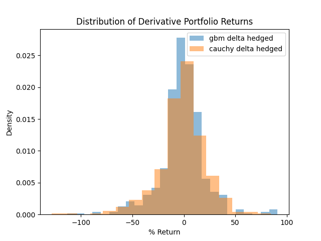

# Kalshi Event Contract Backtester

A Rust-based backtesting framework for evaluating trading strategies on Kalshi event contracts.

## Overview

Event contracts on [Kalshi](https://kalshi.com) are volatile and less liquid than traditional derivatives. Although I've only tested hedging strategies, this project provides a famework for much more general backtests

## Features

- **Data ingestion** for Kalshi order book updates and Coinbase underlying price data
- **Market stream simulation** that synchronizes tick data from multiple securities
- **Greek Exposure Estimates** using different models:
  - Geometric Brownian Motion
  - Cauchy Process

## Results

### Delta Hedge with Underlying

**Backtest Methodology**
- Purchase 1 contract at the earliest available mid-market price where:
  - Spread < 5 cents
  - Bid > 5 cents
  - Ask < 95 cents
- Rebalance hedge every 60 seconds based on model delta
- Compare terminal portfolio value of hedged vs. unhedged positions

